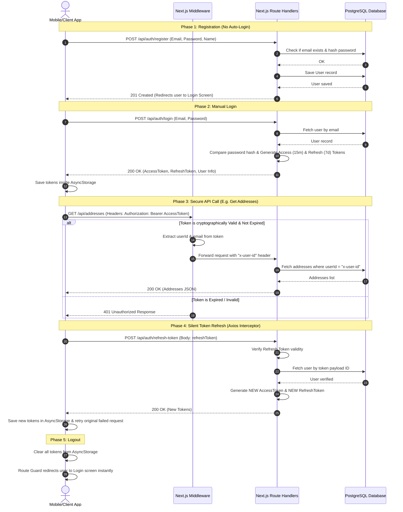

# Complete Backend Architecture, Setup, and Auth Workflow Guide

Yeh comprehensive guide aapko Next.js App Router par ek robust secure backend setup karne, custom APIs design karne, aur authentication manage karne me help karegi. 

Is guide me humne niche likhe contents ko consolidate kiya hai:
1. 📂 **Part 1: Initial Setup & File Migration:** Kaun-kaun si files (Middleware, Prisma Client, Auth configuration, config variables) naye project me direct copy-paste karni hain.
2. 🔄 **Part 2: Security & Authentication Workflow:** Access & Refresh Token rotation mechanism kaise kaam karta hai aur clients ke sath iska sequence diagram aur flow kya hai.
3. 📋 **Part 3: Quick Checklist for Custom APIs:** Kisi bhi naye database model par simple and fast CRUD routes setup karne ke liye copy-paste checklist.
4. 🛠️ **Part 4: Clean & Editable CRUD API Templates:** Highly compressed, optimal, aur safe REST API handlers (GET, POST, PUT, DELETE) jo copy-paste friendly hain, dynamic parameters leverage karte hain, aur automatic raw database error messaging return karte hain.
5. 📖 **Part 5: Swagger Documentation Setup:** JSDoc scan karke interactive Swagger interface `/docs` set up karne ka dynamic tarika.

---

## 📂 Part 1: Naye Project me Kaun-Kaun si Files Copy Karni Hain?

Jab aap ek naya Next.js project setup karenge (`npx create-next-app@latest`), tab is current backend codebase se niche likhi files ko copy karein:

### 1. Core Auth & Database Files
1. **`backend/src/middleware.ts` (Global Route Guard & CORS):**
   * **Kaam:** Sabhi `/api/*` requests ko automatic intercept karta hai, CORS headers add karta hai aur JWT token verify karke `x-user-id` header inject karta hai.
2. **`backend/src/lib/auth.ts` (Auth Helpers):**
   * **Kaam:** Bcrypt password hashing aur JWT token creation/verification (Access and Refresh) ke methods contains karta hai.
3. **`backend/src/lib/prisma.ts` (Prisma Client Instance):**
   * **Kaam:** Singleton instance banata hai taaki development ke dauran database connections limit cross na karein.
4. **`backend/next.config.mjs` (CORS headers rules):**
   * **Kaam:** Next.js level par CORS policies apply karta hai taaki local device ya emulator request block na karein.
5. **`backend/package.json` (Dependencies):**
   * **Kaam:** Make sure aapke naye project me `jsonwebtoken`, `bcryptjs`, `@prisma/client`, `pg`, `swagger-jsdoc`, `swagger-ui-react` dependencies added hon.
6. **`backend/.env` (Environment Template):**
   * **Kaam:** Isme `DATABASE_URL`, `JWT_SECRET` aur `REFRESH_JWT_SECRET` keys copy karein.

### 2. Swagger Docs Files
1. **`backend/src/lib/swagger.ts` (Swagger Config Spec):**
   * **Kaam:** Dinamic tarike se pure project ke `route.ts` files me likhe JSDoc `@swagger` comments ko scan karke JSON OpenAPI specification banata hai.
2. **`backend/src/app/api/swagger/route.ts` (Swagger API Route):**
   * **Kaam:** Spec generate karke JSON format me data client ko deta hai.
3. **`backend/src/app/docs/page.tsx` (Interactive Docs UI Page):**
   * **Kaam:** User/Developer interface render karta hai `/docs` page par jahan API test kiya ja sake.

---

## 🔄 Part 2: Authentication aur Authorization Workflow (Hindi/Hinglish)

Pura security flow 5 phases me divide kiya gaya hai:



### 🔄 3. Pure Flow ke 5 Steps (Workflow)

1. **User Registration (`/api/auth/register`):**
   * User name, email aur password bhejta hai.
   * Backend password ko `bcryptjs` se hash karta hai aur database me save karta hai.
   * **Koibhi Token generate nahi hota.** User ko login screen par bhej diya jata hai.
2. **User Login (`/api/auth/login`):**
   * User credentials submit karta hai.
   * Backend password verify karta hai.
   * Valid hone par **Access Token (15 mins)** aur **Refresh Token (7 days)** generate karke client ko return karta hai.
   * Client in dono tokens ko `AsyncStorage` me safe rakh leta hai.
3. **Protected API Call (E.g. `/api/tasks`):**
   * Client har secure request ke header me `Authorization: Bearer <Access Token>` bhejta hai.
   * Next.js Middleware request intercept karke access token signature verify karta hai.
   * Agar token valid hai, to payload se `userId` read karke request ke header (`x-user-id`) me inject kar deta hai aur control Route Handler ko de deta hai.
4. **Token Expiration (Silent Refresh Flow):**
   * 15 minutes baad `Access Token` expire ho jata hai.
   * Agli API call par backend ka Middleware **401 Unauthorized** return karega.
   * Client ka Axios Interceptor (`axios-instance.ts`) is 401 error ko catch karega aur user ko bina patte chale background me `/api/auth/refresh-token` ko call karega (payload me `Refresh Token` bhejkar).
   * Backend Refresh Token verify karega aur ek naya **Access Token (15m)** aur **New Refresh Token (7d)** return karega.
   * Client naye tokens store karega aur failed API request ko automatically dobara fire karega. User ka session seamless chalta rahega.
5. **Logout Flow:**
   * User "Sign Out" click karega.
   * Client `AsyncStorage` se Access Token, Refresh Token aur User Data **hata** dega.
   * Client ka Route Guard (`use-route-guard.ts`) token na hone ki wajah se user ko `/home` se redirect karke `/login` par lock kar dega.

---

## 📋 Part 3: Naya API Banane Ke Liye Quick Checklist (Copy-Paste Steps)

Agar aapko koi bhi naya CRUD API banana hai (jaise tasks, notes, documents, certificates), to bas in steps ko follow karein:

1. **Step 1: `schema.prisma` me Model banayein:**
   * Naye model me `userId` aur `User` ke sath Cascade relationship define karein.
   * `npx prisma migrate dev --name <migration_name>` run karein.
2. **Step 2: Naya API Folder create karein:**
   * Path: `src/app/api/<your-resource-name>/route.ts` aur `[id]/route.ts` banayein.
3. **Step 3: Code Copy-Paste karein:**
   * **`route.ts` (Multiple Records):** `backend_compelte-workflow.md` ke Part 4.C.1 se codes copy karein aur jahan `prisma.addressBook` aur fields hain, unhe apne naye model ke fields se update karein.
   * **`[id]/route.ts` (Single Record):** Part 4.C.2 se codes copy karein aur parameters/models change karein.
4. **Step 4: Swagger Comments add karein:**
   * Functions ke upar `@swagger` format JSDoc comments add karein aur browser me `/docs` par check karein.

---

## 🛠️ Part 4: Example API Walkthrough (Simple Name & Address API)

Maan lijiye aapko ek naya feature **AddressBook** banana hai, jisme user apne contacts ke **Name** aur **Address** ko save, view, edit aur delete kar sake (Complete CRUD operation).

### Step A: Prisma Model Create Karein
Sabse pehle `prisma/schema.prisma` file me apne user model ke niche yeh schema define karein (Isme koi extra tasks module dynamic relation nahi hai, code bilkul clean aur simple hai):

```prisma
model AddressBook {
  id        String   @id @default(uuid())
  name      String
  address   String
  userId    String
  // User ke delete hone par uske address automatic delete ho jayein (Cascade delete)
  user      User     @relation(fields: [userId], references: [id], onDelete: Cascade)
  createdAt DateTime @default(now())
  updatedAt DateTime @updatedAt
}

// User model:
model User {
  id           String        @id @default(uuid())
  email        String        @unique
  password     String
  name         String?
  createdAt    DateTime      @default(now())
  updatedAt    DateTime      @updatedAt
  addresses    AddressBook[] // User to AddressBook relation
}
```

Naye database structures/tables apply karne ke liye migration run karein:
```bash
npx prisma migrate dev --name add_address_book
npx prisma generate
```

---

### Step B: Naye API ki Folder Structure
Next.js App router API rules ke hisab se structure is tarah dikhegi:
```text
src/app/api/addresses/
├── route.ts          <-- Address create karne aur list (GET/POST) ke liye
└── [id]/
    └── route.ts      <-- Specific address read, edit, delete (GET/PUT/DELETE) ke liye
```

---

### Step C: API Codes (CRUD Operations)

#### 1. Multiple Elements API: `src/app/api/addresses/route.ts`
*(GET list all, POST create a new address)*

```typescript
import { NextResponse } from 'next/server';
import { prisma } from '@/lib/prisma';
import { getUserIdFromRequest } from '@/lib/auth';

// ==========================================
// 1. GET - Logged-in user ke sabhi records list karein
// ==========================================
export async function GET(req: Request) {
  try {
    // A. Middleware se verified user-id ko read karein (Auth Check)
    const userId = await getUserIdFromRequest(req);
    if (!userId) {
      return NextResponse.json({ error: 'Unauthorized: Invalid token' }, { status: 401 });
    }

    // B. Prisma se database query chalayein aur logged-in user ke records fetch karein
    // [EDITABLE MODEL]: Apne model ke naam 'addressBook' ko update karein
    const records = await prisma.addressBook.findMany({
      where: { userId },
      orderBy: { createdAt: 'desc' }, // Naye records ko pehle fetch karne ke liye
    });

    // C. Results return karein
    return NextResponse.json(records);
  } catch (error: any) {
    console.error('GET API Error:', error);
    // [REAL SYSTEM ERROR]: Actual database/code error message return karein client ko
    return NextResponse.json({ error: error.message || 'Internal server error' }, { status: 500 });
  }
}

// ==========================================
// 2. POST - Logged-in user ke liye naya record create karein
// ==========================================
export async function POST(req: Request) {
  try {
    // A. User auth token verify karein
    const userId = await getUserIdFromRequest(req);
    if (!userId) {
      return NextResponse.json({ error: 'Unauthorized' }, { status: 401 });
    }

    // B. Request body se payload variables fetch karein
    const body = await req.json();
    
    // [EDITABLE FIELDS]: Apne naye fields ko yahan destructure karein
    const { name, address } = body;

    // C. Validation Check: Make sure required fields are present
    // [EDITABLE VALIDATION]: Apne required parameters ko validation me check karein
    if (!name || !address) {
      return NextResponse.json({ error: 'Missing required parameters: name and address are required' }, { status: 400 });
    }

    // D. Database me record insert karein
    // [EDITABLE MODEL/FIELDS]: Model aur fields update karein
    const newRecord = await prisma.addressBook.create({
      data: {
        name,
        address,
        userId,
      },
    });

    // E. 201 status ke sath created record send karein
    return NextResponse.json(newRecord, { status: 201 });
  } catch (error: any) {
    console.error('POST API Error:', error);
    // [REAL SYSTEM ERROR]: Return actual error message
    return NextResponse.json({ error: error.message || 'Internal server error' }, { status: 500 });
  }
}
```

---

#### 2. Single Element API: `src/app/api/addresses/[id]/route.ts`
*(GET single address, PUT update address, DELETE delete address)*

```typescript
import { NextResponse } from 'next/server';
import { prisma } from '@/lib/prisma';
import { getUserIdFromRequest } from '@/lib/auth';

// ==========================================
// 1. GET - Kisi specific record ki details read karein
// ==========================================
export async function GET(req: Request, { params }: { params: { id: string } }) {
  try {
    // A. User authentication check
    const userId = await getUserIdFromRequest(req);
    if (!userId) return NextResponse.json({ error: 'Unauthorized' }, { status: 401 });

    // B. Check if record exists and belongs to this user
    // [EDITABLE MODEL]: Model name 'addressBook' change karein
    const record = await prisma.addressBook.findFirst({
      where: { id: params.id, userId },
    });
    if (!record) return NextResponse.json({ error: 'Record not found' }, { status: 404 });

    return NextResponse.json(record);
  } catch (error: any) {
    console.error('GET Single API Error:', error);
    // [REAL SYSTEM ERROR]: Return actual error message
    return NextResponse.json({ error: error.message || 'Internal server error' }, { status: 500 });
  }
}

// ==========================================
// 2. PUT - Kisi specific record ko edit/update karein
// ==========================================
export async function PUT(req: Request, { params }: { params: { id: string } }) {
  try {
    // A. User authentication check
    const userId = await getUserIdFromRequest(req);
    if (!userId) return NextResponse.json({ error: 'Unauthorized' }, { status: 401 });

    const { id } = params;
    
    // [EDITABLE FIELDS]: Body se update karne waale input fields destructure karein
    const { name, address } = await req.json();

    // B. Verify ownership (Check if record exists and belongs to this user)
    // [EDITABLE MODEL]: Model name 'addressBook' change karein
    const record = await prisma.addressBook.findFirst({
      where: { id, userId },
    });
    if (!record) {
      return NextResponse.json({ error: 'Record not found or access denied' }, { status: 404 });
    }

    // C. Perform database update (Prisma automatically ignores undefined fields)
    // [EDITABLE MODEL/FIELDS]: Model aur fields check karein
    const updated = await prisma.addressBook.update({
      where: { id },
      data: { name, address },
    });

    return NextResponse.json(updated);
  } catch (error: any) {
    console.error('PUT API Error:', error);
    // [REAL SYSTEM ERROR]: Actual database/code error message return karein client ko
    return NextResponse.json({ error: error.message || 'Internal server error' }, { status: 500 });
  }
}

// ==========================================
// 3. DELETE - Kisi specific record ko remove/delete karein
// ==========================================
export async function DELETE(req: Request, { params }: { params: { id: string } }) {
  try {
    // A. User authentication check
    const userId = await getUserIdFromRequest(req);
    if (!userId) return NextResponse.json({ error: 'Unauthorized' }, { status: 401 });

    // B. Verify ownership (Check if record exists and belongs to this user)
    // [EDITABLE MODEL]: Model name 'addressBook' change karein
    const record = await prisma.addressBook.findFirst({
      where: { id: params.id, userId },
    });
    if (!record) {
      return NextResponse.json({ error: 'Record not found or access denied' }, { status: 404 });
    }

    // C. Database se permanently remove karein
    // [EDITABLE MODEL]: Model name 'addressBook' change karein
    await prisma.addressBook.delete({
      where: { id: params.id },
    });

    return NextResponse.json({ message: 'Record deleted successfully' });
  } catch (error: any) {
    console.error('DELETE API Error:', error);
    // [REAL SYSTEM ERROR]: Return actual error
    return NextResponse.json({ error: error.message || 'Internal server error' }, { status: 500 });
  }
}
```

---

## 📖 Part 5: Swagger API Docs Setup aur Implementation

Swagger dynamic tarike se files scan karke documentation build karta hai. Isko set karne ka tarika niche diya gaya hai:

### Step 1: Core Swagger Swagger Spec Utility (`src/lib/swagger.ts`)
* `swagger-jsdoc` ko configuration object dekar OpenAPI Spec build karne ke liye is file ko copy/write karein:
```typescript
import swaggerJSDoc from 'swagger-jsdoc';

export const getApiDocs = async () => {
  const options = {
    definition: {
      openapi: '3.0.0',
      info: {
        title: 'App System API Documentation',
        version: '1.0.0',
        description: 'Interactive Open API Documentation for our application services',
      },
      servers: [
        {
          url: 'http://localhost:5000',
          description: 'Local development server',
        },
      ],
      components: {
        securitySchemes: {
          BearerAuth: {
            type: 'http',
            scheme: 'bearer',
            bearerFormat: 'JWT',
          },
        },
      },
    },
    // Scan all API route files for JSDoc documentation comments
    apis: ['./src/app/api/**/*.ts'],
  };

  return swaggerJSDoc(options);
};
```

### Step 2: Spec Route Endpoint (`src/app/api/swagger/route.ts`)
* Swagger JSON schema serve karne ke liye route copy karein:
```typescript
import { getApiDocs } from '@/lib/swagger';
import { NextResponse } from 'next/server';

export const dynamic = 'force-dynamic';

export const GET = async () => {
    try {
        const spec = await getApiDocs();
        return NextResponse.json(spec);
    } catch {
        return NextResponse.json({ error: 'Failed to generate API docs' }, { status: 500 });
    }
};
```

### Step 3: Interactive UI Screen Docs Page (`src/app/docs/page.tsx`)
* client-side UI docs screen ko page render karne ke liye copy/write karein:
```typescript
'use client';

import React, { useEffect, useState } from 'react';
import dynamic from 'next/dynamic';
import 'swagger-ui-react/swagger-ui.css';

// Dynamically loading to avoid SSR server compilation issues
const SwaggerUI = dynamic(() => import('swagger-ui-react'), { ssr: false });

export default function ApiDocs() {
    const [spec, setSpec] = useState<Record<string, unknown> | null>(null);
    const [mounted, setMounted] = useState(false);

    useEffect(() => {
        setMounted(true);
        fetch('/api/swagger')
            .then((res) => res.json())
            .then((data) => setSpec(data));
    }, []);

    if (!mounted || !spec) {
        return (
            <div className="flex flex-col items-center justify-center min-h-screen bg-slate-50">
                <div className="w-12 h-12 border-4 border-slate-200 border-t-blue-500 rounded-full animate-spin mb-4"></div>
                <p className="text-slate-600 font-medium">Initializing API Documentation...</p>
            </div>
        );
    }

    return (
        <div className="min-h-screen bg-white">
            <div className="max-w-5xl mx-auto px-4 py-4">
                <SwaggerUI spec={spec} deepLinking={true} docExpansion="list" filter={true} />
            </div>
        </div>
    );
}
```

### Step 4: Swagger use karne ka example format:
Apne Route Handlers ke functions ke upar is standard format me JSDoc comments add karein. Swagger ise automatically read karke docs UI me add kar dega.

#### A. Multiple Elements Route (`src/app/api/addresses/route.ts`):
```typescript
/**
 * @swagger
 * /api/addresses: # [EDIT: Apne resource path se change karein]
 *   get:
 *     summary: Get all addresses # [EDIT: Endpoint summary]
 *     description: Logged-in user ke sabhi saved address book entries ko fetch karein. # [EDIT: Description]
 *     tags: [Addresses] # [EDIT: Swagger group tag]
 *     security:
 *       - BearerAuth: []
 *     responses:
 *       200:
 *         description: Success - Addresses array return hota hai.
 *       401:
 *         description: Unauthorized - Token missing ya invalid hai.
 *       500:
 *         description: Internal Server Error.
 * 
 *   post:
 *     summary: Create a new address # [EDIT: Endpoint summary]
 *     description: Logged-in user ke account me naya address book record save karein. # [EDIT: Description]
 *     tags: [Addresses] # [EDIT: Swagger group tag]
 *     security:
 *       - BearerAuth: []
 *     requestBody:
 *       required: true
 *       content:
 *         application/json:
 *           schema:
 *             type: object
 *             required:
 *               - name # [EDIT: Required body input fields list]
 *               - address # [EDIT]
 *             properties:
 *               name: # [EDIT: Input property name]
 *                 type: string
 *                 example: "Rajan Kumar" # [EDIT: Example input value]
 *               address: # [EDIT: Input property name]
 *                 type: string
 *                 example: "Flat 104, Green Apartment, Delhi" # [EDIT: Example input value]
 *     responses:
 *       201:
 *         description: Created - Record successfully database me save ho gaya.
 *       400:
 *         description: Bad Request - Missing required parameters (name ya address missing).
 *       401:
 *         description: Unauthorized.
 *       500:
 *         description: Internal Server Error.
 */
```

#### B. Single Element Route (`src/app/api/addresses/[id]/route.ts`):
```typescript
/**
 * @swagger
 * /api/addresses/{id}: # [EDIT: Apne dynamic resource path se change karein]
 *   get:
 *     summary: Get a single address # [EDIT: Endpoint summary]
 *     description: Record ID aur token verify karke specific address book entry details return karein. # [EDIT: Description]
 *     tags: [Addresses] # [EDIT: Swagger group tag]
 *     security:
 *       - BearerAuth: []
 *     parameters:
 *       - in: path
 *         name: id
 *         required: true
 *         schema:
 *           type: string
 *         description: Address record ki unique UUID string # [EDIT: Path parameter description]
 *     responses:
 *       200:
 *         description: Success - Record details found.
 *       401:
 *         description: Unauthorized.
 *       404:
 *         description: Not Found - Record user ka nahi hai ya exist nahi karta.
 *       500:
 *         description: Internal Server Error.
 * 
 *   put:
 *     summary: Update an address # [EDIT: Endpoint summary]
 *     description: Specific record ko dynamically select karke name aur/ya address fields update karein. # [EDIT: Description]
 *     tags: [Addresses] # [EDIT: Swagger group tag]
 *     security:
 *       - BearerAuth: []
 *     parameters:
 *       - in: path
 *         name: id
 *         required: true
 *         schema:
 *           type: string
 *         description: Address record ID
 *     requestBody:
 *       required: true
 *       content:
 *         application/json:
 *           schema:
 *             type: object
 *             properties:
 *               name: # [EDIT: Update input property name]
 *                 type: string
 *                 example: "Rajan Kumar updated" # [EDIT: Example input value]
 *               address: # [EDIT: Update input property name]
 *                 type: string
 *                 example: "Flat 205, Blue Apartment, Delhi" # [EDIT: Example input value]
 *     responses:
 *       200:
 *         description: Success - Record update ho gaya aur updated object return hota hai.
 *       400:
 *         description: Bad Request - No parameters provided for update.
 *       401:
 *         description: Unauthorized.
 *       404:
 *         description: Not Found.
 *       500:
 *         description: Internal Server Error.
 * 
 *   delete:
 *     summary: Delete an address # [EDIT: Endpoint summary]
 *     description: Specific record ID ke database item ko permanently remove karein. # [EDIT: Description]
 *     tags: [Addresses] # [EDIT: Swagger group tag]
 *     security:
 *       - BearerAuth: []
 *     parameters:
 *       - in: path
 *         name: id
 *         required: true
 *         schema:
 *           type: string
 *         description: Address record ID to delete
 *     responses:
 *       200:
 *         description: Success - Record successfully deleted.
 *       401:
 *         description: Unauthorized.
 *       404:
 *         description: Not Found or access denied.
 *       500:
 *         description: Internal Server Error.
 */
```

Aap `/docs` par jakar live browser me complete API documentation use kar sakte hain!
